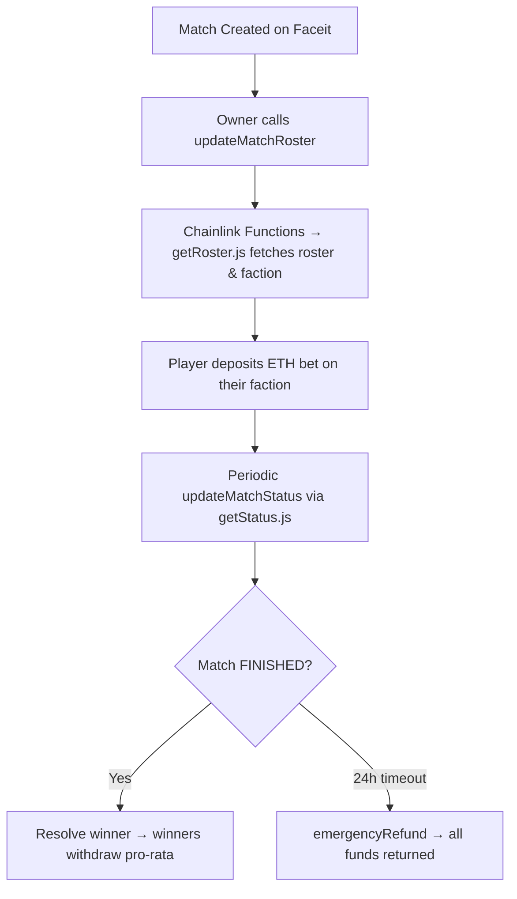

## Fragbox-Contracts

You can interact with these contracts at [our website](https://fragbox.gg/)

# About

- Chainlink price feed oracles
- Chainlink functions 3rd party API integration

# FragBox - CS2 Faceit PUG Betting on Chain


**Decentralized escrow betting for Counter-Strike 2 Faceit pickup games.** Players wager crypto on their own pugs — winners take money directly from the losing team. All transactions on **Base**. Match-fixing is impossible: you can only bet if you're verified in the match, and you can never bet against yourself.

Roster and outcome verification happens trustlessly via **Chainlink Functions** + the official Faceit Data API. Built as a production-grade Solidity portfolio project to showcase advanced oracle integration, escrow mechanics, and real-world esports data on-chain.

## ✨ Features

- **Anti-Match-Fixing Protection**: Only participating players can bet, and only on their own faction (verified via Faceit roster API).
- **Dynamic Match States**: On-chain tracking of "READY" / "ONGOING" / "FINISHED" with winner faction resolution.
- **USD-Minimum Bets**: Enforced via Chainlink ETH/USD Price Feed (~$5 minimum).
- **1% House Fee**: Collected on every deposit and sent to the owner.
- **Pro-Rata Payouts**: Winners split the pot proportionally (minus fee). If nobody bets on the winner → full refunds to all bettors.
- **Invalid Bet Auto-Cleanup**: Bets from players not in the verified roster are automatically refunded.
- **Emergency Timeout Refund**: Full refund after 24 hours if a match never finishes.
- **Gas-Optimized & Secure**: Bytes32 match keys, custom lightweight JSON parser in Solidity, full event logging.

## 🛠 How It Works



1. Roster Verification — updateMatchRoster triggers a Chainlink Function request using getRoster.js. Faceit API returns players + factions. Contract stores verified mapping and refunds any invalid bets.
2. Place Bet (deposit) — Player must be verified in roster, bet ≥ $5 USD (price feed), 1% fee taken. Only your own faction allowed.
3. Status Monitoring — updateMatchStatus (callable by anyone, 5-minute cooldown) uses getStatus.js to detect completion and winner.
4. Resolution — Match marked resolved → winners claim via withdraw.
5. Safety — emergencyRefund available after TIMEOUT_DURATION (24h).

📋 Smart Contracts
Contract,Purpose,Key Highlights
FragBoxBetting.sol,Core betting escrow + Chainlink integration,"FunctionsClient, ReentrancyGuard, Ownable. Handles bets, roster/status callbacks, payouts, refunds."
OracleLib.sol,Custom library for Chainlink price feeds,Stale round data protection (prevents manipulation).
ChainChecker.sol,Test utilities,Base chain ID detection (Mainnet/Sepolia/Anvil).

Advanced Techniques Used:
- Custom inline JSON parser for Chainlink callback responses (gas-efficient, no external libraries).
- DON-hosted secrets for secure Faceit API key management.
- Comprehensive custom errors and events for full transparency.
- State cooldowns and request ID tracking to prevent spam/replay attacks.

🧪 Tech Stack
- Language & Framework: Solidity ^0.8.24 + Foundry (Forge, Anvil, Cast)
- Oracles:
    - Chainlink Functions (3rd-party API integration) — getRoster.js & getStatus.js for Faceit Data API v4
    - Chainlink Price Feed Oracles (ETH/USD) + custom OracleLib
- Security: OpenZeppelin (ReentrancyGuard, Ownable, SafeCast, Address, Strings), custom error handling, timeout protections
- Chain: Base (optimized for low fees — deployed to Sepolia for testing, Mainnet ready)
- Other: DON-hosted secrets, gas-optimized mappings, event-driven architecture, Foundry test suite with mocked Chainlink fulfillments

🚀 Getting Started
Prerequisites
- Foundry
- Node.js (for Chainlink Functions scripts & secret uploads)

Installation
```bash
git clone https://github.com/Fragbox-gg/fragbox-contracts.git
cd fragbox-contracts
forge install
npm install
```

Build, Test & Deploy
```bash
forge build
forge test -vvv                  # Full test suite (roster validation, payouts, refunds, edge cases)
forge script script/DeployFragBoxBetting.s.sol --rpc-url base_sepolia --broadcast
```

Key Test Cases Covered:
- Valid/invalid bet placement & roster checks
- Chainlink Functions fulfillment (roster + status)
- Auto-cleanup of invalid bets
- Emergency refunds after timeout
- Full refunds when nobody bets on winner
- Price feed staleness protection

Chainlink Functions Scripts
- script/functions/getRoster.js — Fetches match roster & determines player's faction
- script/functions/getStatus.js — Returns match status + winner (if finished)
- Secret management: uploadFaceitSecretsToBaseSepolia.js + verify-faceit-functions.js

🔒 Security Considerations
- ReentrancyGuard on all state-changing functions
- Stale price feed protection via OracleLib
- Owner-only sensitive operations (roster/status triggers, secret updates)
- No admin withdrawal backdoors — funds are purely escrow-based
- Comprehensive error conditions and events for auditability
- 5-minute status update cooldown prevents spam

This project demonstrates production-ready patterns: decentralized third-party API integration, secure escrow betting, dynamic outcome resolution, and real-world esports data verification.

📜 License
MIT — see [LICENSE](LICENSE)

👨‍💻 About the Developer
Built by Patrick  as a portfolio showcase for Solidity freelancing.
Highlights for clients:
- Real Chainlink Functions + Price Feed integration
- Custom off-chain JavaScript + on-chain JSON parsing
- Escrow + payout logic with anti-collusion guarantees
- Foundry-based testing & deployment

Open to freelance Solidity work — audits, new contracts, Chainlink integrations, or Base L2 projects. DM on X or open an issue!

*Built for fun and to prove what's possible when esports meets crypto. Bet responsibly. Not financial advice.*