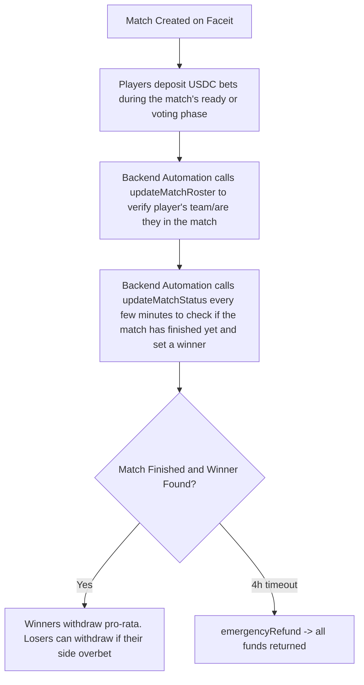

# FragBox - CS2 Faceit PUG Betting on Chain
[](https://soliditylang.org/)
[](https://book.getfoundry.sh/)
[](https://base.org/)
[](https://www.circle.com/en/usdc)

[](https://opensource.org/licenses/MIT)

**Decentralized escrow betting for Counter-Strike 2 Faceit pickup games (1v1, 5v5, and more).**

Players bet USDC on **their own team** and win money directly from the opposing side. Match-fixing is prevented by Faceit API verification + wallet registration - you can only bet if you’re actually in the match and only on yourself winning.

Live platform: **[fragbox.gg](https://fragbox.gg/)**

Roster and outcome verification happens via onlyOwner methods. Built as a production-grade Solidity project to showcase advanced escrow mechanics and real-world esports data on-chain. Why didn't we use chainlink functions? It was simply too expensive per match. Each match requires many roster validation calls and match status update calls. Chainlink functions would make the business economically unviable, otherwise we would have to charge insane fees for our players.

## ✨ Key Features

- **Ironclad Anti-Match-Fixing**: Only verified players in the match can bet, and only on their own faction (Faceit roster API).
- **Wallet Registration**: Players sign in with Faceit/Steam on the website and connect their wallet before betting.
- **Tiered Betting with USD Minimums**: Players bet in tiered queues, enforced on chain. Tiers are configurable by the contract owner.
- **Dynamic Match States**: On-chain tracking of "READY" / "ONGOING" / "FINISHED" with winner faction resolution.
- **1% House Fee**: Collected on every deposit and sent to the owner.
- **Pro-Rata Payouts**: Winners split the pot proportionally (minus fee). If nobody bets on the winner → full refunds to all bettors.
- **Automatic Safety Nets**
  - Invalid bets (not in verified roster) are auto-refunded.
  - Emergency full refund after 4 hours if a match never finishes.
- **Gas-Optimized & Secure** — `bytes32` match keys, `ReentrancyGuard`, `Pausable`, comprehensive custom errors + events.
- **Seamless Player Experience** — Built for Coinbase CDP Smart Wallets + Paymaster (zero visible gas), on-ramps, and a planned Chrome extension.

## 🎮 Realistic Player Experience

1. Go to **[fragbox.gg](https://fragbox.gg/)** → “Sign in with Faceit”
2. “Buy USDC” button appears → pay with card/bank (Coinbase Onramp)
3. Chrome extension detects your active Faceit match → “Bet $50 USDC on this match”
4. Click **Deposit** → transaction happens instantly with zero gas visible (Coinbase Smart Wallet + Paymaster)
5. After the match → “Claim winnings” → USDC lands in your embedded wallet
6. “Sell for cash” → cash out back to bank via Coinbase

## 🛠 How It Works



**Backend Automation** (currently powered by cron-job.org):
- script/functions/getRoster.js - verifies player’s faction and sets it on-chain (called once per player per match)
- script/functions/getStatus.js - checks if match is finished and who won (called repeatedly until resolved)

**Example full match flow:**
1. Player calls deposit() → emits BetPlaced
2. Backend calls updateMatchRoster()
3. Backend calls updateMatchStatus() until API returns MatchStatus.Finished
4. Player (or automation) calls claim() or emergencyRefund()
5. Players call withdraw() when ready

## 📋 Smart Contracts
| Contract | Purpose | Key Highlights |
| -------- | ------- | -------------- |
| FragBoxBetting.sol | Core betting & escrow logic | ReentrancyGuard, Ownable, Pausable, tier management, roster/status callbacks, pro-rata payouts, emergency refunds, in-flight bet handling

**Main functions:**

- deposit() - place a bet (must be verified in roster)
- updateMatchRoster() - owner-only (backend) sets verified player factions
- updateMatchStatus() - owner-only (backend) updates match state & winner
- claim() - payout logic after match finishes
- emergencyRefund() - full refund after 4-hour timeout
- withdraw() - claim accumulated winnings

## 🧪 Tech Stack

- Smart Contracts: Solidity ^0.8.24 + Foundry (Forge, Anvil, Cast)
- Blockchain: Base (low fees)
- Token: USDC (via SafeERC20)
- Price Feed: Chainlink ETH/USD
- Frontend: Next.js + Vercel + Neon Postgres (see [fragbox-web](https://github.com/Fragbox-gg/fragbox-web))
- Wallets: Coinbase CDP Smart Wallet + CDP Paymaster
- Backend: Node.js scripts + cron-job.org automation
- Verification: Faceit Data API v4 (owner-called for cost efficiency)
- Security: OpenZeppelin (ReentrancyGuard, Ownable, Pausable, IERC20Metadata, SafeERC20), custom error handling, timeout protections

🚀 Getting Started
Prerequisites
- Foundry
- Node.js

Installation
```bash
git clone https://github.com/Fragbox-gg/fragbox-contracts.git
cd fragbox-contracts
forge install
npm install
```

Build, Test & Deploy
```bash
forge build
make test
forge script script/DeployFragBoxBetting.s.sol --rpc-url base_sepolia --broadcast
```

Test Suite (comprehensive coverage):
- test/FragBoxBettingTest.t.sol
- test/FragBoxBettingFuzzTest.t.sol
- test/FragBoxBettingInvariantTest.t.sol
- test/handlers/FragBoxHandler.sol

🔒 Security Considerations
- ReentrancyGuard on all state-changing functions
- Pausable for emergencies
- Timeouts for in-flight bets and emergency refunds
- Owner-only sensitive operations (roster & status updates)
- Full event logging and custom errors for auditability
- No admin backdoors - pure escrow mechanics

*This project has not yet undergone a formal third-party audit. Use at your own risk and bet responsibly.*

📜 License
MIT - see [LICENSE](LICENSE)

👨‍💻 About
Fragbox is a passion project combining competitive CS2 Faceit pugs with decentralized finance. Built as a production-grade showcase of secure on-chain escrow betting with real-world esports data integration.

*Built for fun and to prove what's possible when esports meets crypto. Bet responsibly. Not financial advice.*