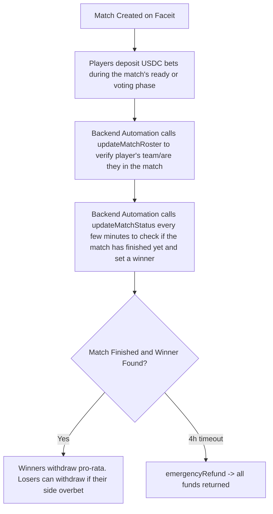

## Fragbox-Contracts

You can interact with these contracts at [our website](https://fragbox.gg/)

# FragBox - CS2 Faceit PUG Betting on Chain


**Decentralized escrow betting for Counter-Strike 2 Faceit pickup games.** Players wager crypto on their own pugs, winners take money directly from the losing team. All transactions on **Base**. Match-fixing is impossible: you can only bet if you're verified in the match (by us), and you can never bet against yourself.

Roster and outcome verification happens via onlyOwner methods. Built as a production-grade Solidity project to showcase advanced escrow mechanics and real-world esports data on-chain. Why didn't we use chainlink functions? It was simply too expensive per match. Each match requires many roster validation calls and match status update calls. Chainlink functions would make the business economically unviable, otherwise we would have to charge insane fees for our players.

## ✨ Features

- **Anti-Match-Fixing Protection**: Only participating players can bet, and only on their own faction (verified via Faceit roster API).
- **Dynamic Match States**: On-chain tracking of "READY" / "ONGOING" / "FINISHED" with winner faction resolution.
- **USD-Minimum Bets**: Enforced via Chainlink ETH/USD Price Feed (~$5 minimum).
- **1% House Fee**: Collected on every deposit and sent to the owner.
- **Pro-Rata Payouts**: Winners split the pot proportionally (minus fee). If nobody bets on the winner → full refunds to all bettors.
- **Invalid Bet Auto-Cleanup**: Bets from players not in the verified roster are automatically refunded.
- **Emergency Timeout Refund**: Full refund after 4 hours if a match never finishes.
- **Gas-Optimized & Secure**: Bytes32 match keys instead of strings and full event logging.

## 🛠 How It Works



1. Roster Verification: updateMatchRoster puts Faceit match data on chain. Contract stores verified mapping and refunds any invalid bets, such as betting on the enemy team or betting on a match you aren't in.
2. Place Bet (deposit): Player must be verified in roster (verification can happen after the bet), bet > tier minimum and < tier maximum, 1% fee taken.
3. Status Monitoring: updateMatchStatus puts Faceit match data on chain to detect match state/completion and winner.
4. Resolution: Match is finished and has a winner -> winners claim via withdraw.
5. Safety: emergencyRefund available after TIMEOUT_DURATION (4h).

📋 Smart Contracts
Contract,Purpose,Key Highlights
FragBoxBetting.sol,Core betting escrow,"ReentrancyGuard, Ownable. Handles bets, roster/status callbacks, payouts, refunds."
ChainChecker.sol,Test utilities,Base chain ID detection (Mainnet/Sepolia/Anvil).

Advanced Techniques Used:
- Comprehensive custom errors and events for full transparency.

🧪 Tech Stack
- Language & Framework: Solidity ^0.8.24 + Foundry (Forge, Anvil, Cast)
- Oracles:
    - OnlyOwner functions for getting Faceit Data API v4 on chain. Chainlink Functions is too expensive for this project. In the future we can make our own DON if we want.
- Security: OpenZeppelin (ReentrancyGuard, Ownable, SafeCast, Address, Strings), custom error handling, timeout protections
- Chain: Base (optimized for low fees — deployed to Sepolia for testing, Mainnet ready)
- Other: DON-hosted secrets, gas-optimized mappings, event-driven architecture, Foundry test suite with mocked Chainlink fulfillments

🚀 Getting Started
Prerequisites
- Foundry
- Node.js

Installation
```bash
git clone https://github.com/Fragbox-gg/fragbox-contracts.git
cd fragbox-contracts
forge install
npm install
```

Build, Test & Deploy
```bash
forge build
make test
forge script script/DeployFragBoxBetting.s.sol --rpc-url base_sepolia --broadcast
```

Key Test Cases Covered:
- Valid/invalid bet placement & roster checks
- Chainlink Functions fulfillment (roster + status)
- Auto-cleanup of invalid bets
- Emergency refunds after timeout
- Full refunds when nobody bets on winner
- Price feed staleness protection

Chainlink Functions Scripts
- script/functions/getRoster.js — Fetches match roster & determines player's faction
- script/functions/getStatus.js — Returns match status + winner (if finished)
- Secret management: uploadFaceitSecretsToBaseSepolia.js + verify-faceit-functions.js

🔒 Security Considerations
- ReentrancyGuard on all state-changing functions
- Stale price feed protection via OracleLib
- Owner-only sensitive operations (roster/status triggers, secret updates)
- No admin withdrawal backdoors — funds are purely escrow-based
- Comprehensive error conditions and events for auditability
- 5-minute status update cooldown prevents spam

This project demonstrates production-ready patterns: decentralized third-party API integration, secure escrow betting, dynamic outcome resolution, and real-world esports data verification.

📜 License
MIT — see [LICENSE](LICENSE)

👨‍💻 About the Developer
Built by Patrick Seeman as a portfolio showcase/passion project for Solidity work.
Highlights:
- Real 3rd party API integration on chain
- Custom off-chain JavaScript
- Escrow + payout logic with anti-collusion guarantees
- Foundry-based testing & deployment

*Built for fun and to prove what's possible when esports meets crypto. Bet responsibly. Not financial advice.*